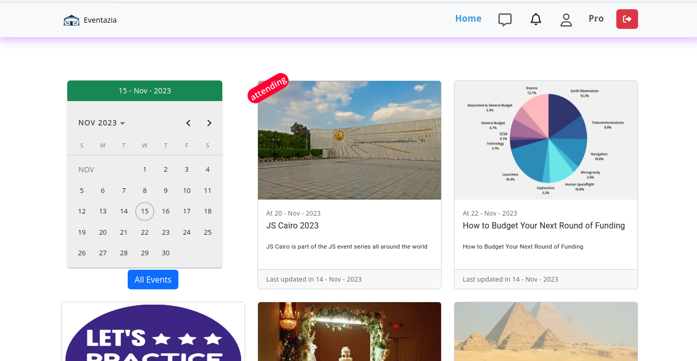
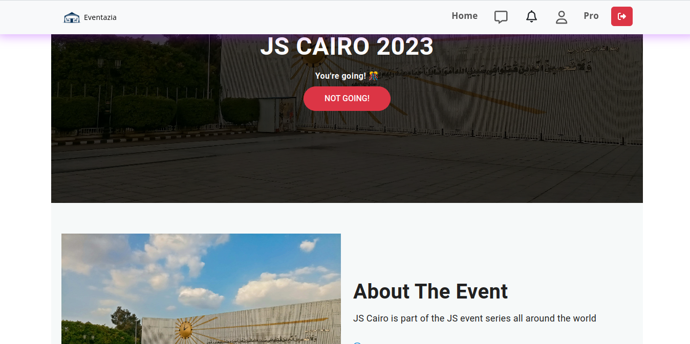
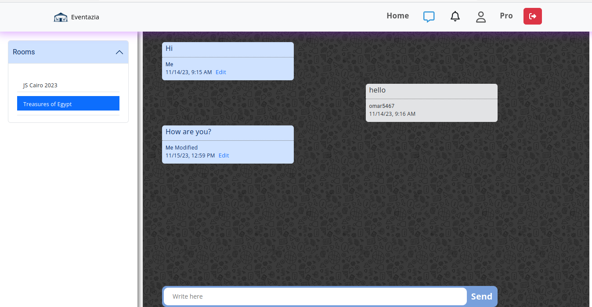
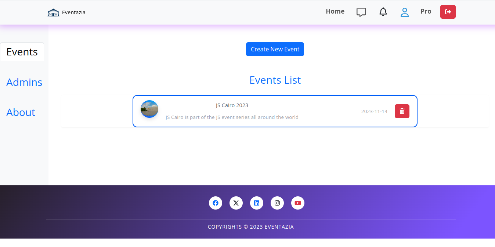
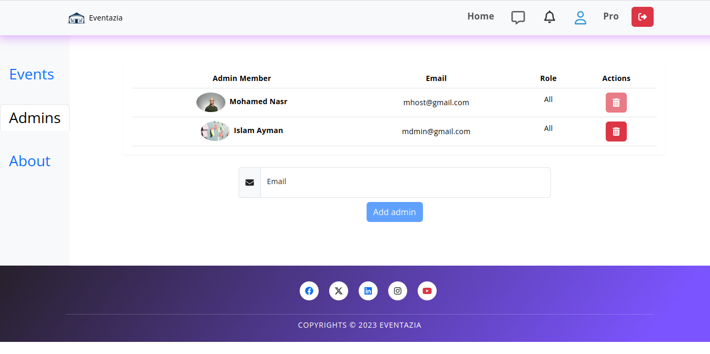

# Eventazia

Website that can serve all users who need to organize or attend events.

## Taple of contents

- [Eventazia](#eventazia)
  - [Taple of contents](#taple-of-contents)
  - [Overview](#overview)
    - [Features](#features)
    - [Screenshot](#screenshot)
    - [Links](#links)
  - [Processes](#processes)
    - [Built with](#built-with)
    - [Installation](#installation)
  - [Author](#author)

## Overview

This is the graduation project of Intensive Code Camp(ICC) - Full Stack using MERN - IT Institute

### Features

- Registration, which includes email verification messages
- Authentication with tell the user why they are not logged in
- Data validation in all levels (Frontend, Backend, Database)
- Find all events that interest the user filtered by date
- Chat room for all users attending the event
- Notification system
- Creating a hosting that enables the user to create and control all the events that interest him
- Create a place to allow the event creator to host it there
- Upgrade plan for unlimited features

### Screenshot

- 
- 
- 
- 
- 

### Links

- [GitHub URL](https://github.com/mohamedashrraf/Event-Management)
- [Live URL](https://eventazia.vercel.app/)

## Processes

- Brainstorming & Data Collection
- Website colors & Design
- Front end & Back end development cycle
- Testing
- Deployment

### Built with

- Angular
- SCSS
- Bootstrap
- Font Awesome
- ngx-socket-io
- jwt-decode
- date-fns
- angular-calendar
- zone.js

### Installation

```shell
# Example commands
git clone https://github.com/mohamedashrraf/Event-Management.git
cd Event-Management.git
npm install
npm run start
```

## Author

- [Mohamed Ashraf](https://www.linkedin.com/in/mohamedashrraf/)
- [Abdelrhman Sherif](https://www.linkedin.com/in/abdelrhman-sherif/)
- [Esraa Mohsen](https://www.linkedin.com/in/esraa-mohsen-356687233/)
- [Muhammad Al-kilany](https://www.linkedin.com/in/muhammadalkilany/)
- [Omar Gamal](https://www.linkedin.com/in/omar-gamal-98ab57219/)
- [Mohamed Nasr](https://www.linkedin.com/in/mhmdnsr-dev)
